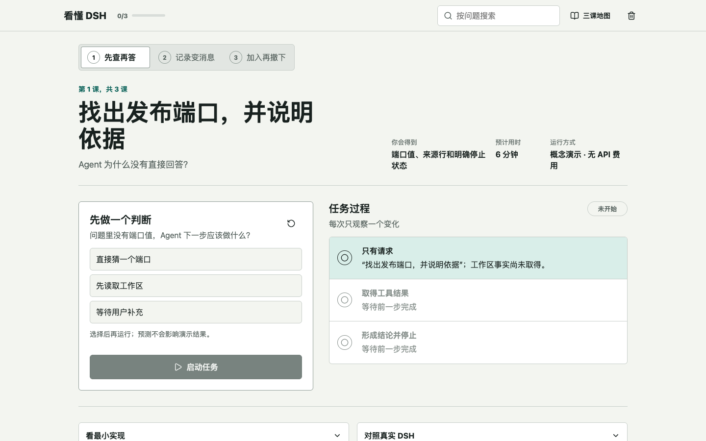

# Learn DeepSeek Harness

从一次看得见的 Agent 任务出发，先获得直觉，再逐层理解 DeepSeek Harness 如何调用工具、记录过程和扩展能力。

首个纵向切片只包含三课：工具结果如何改变回答、Session 记录如何投影成模型消息、工具能力如何注册并撤销。演示全部在浏览器本地确定性运行，不调用模型、不需要 API key，也不产生 API 费用。



## 开发

```sh
pnpm install
pnpm dev
pnpm check
pnpm test:e2e
```

Node.js 22+ 与 pnpm 11.19.0。

## 当前范围

- 三课共享一套显式状态机：预测、运行、观察、单变量实验、迁移检查。
- 问题语言搜索、三课地图、本地进度恢复、单课重置和全部清除。
- 固定提交的 claim 证据页与教学简化说明。
- `390 x 844`、`768 x 1024`、`1440 x 900` 响应式路径。

当前是等待 M4 独立用户测试的可用原型；GitHub Pages 尚未启用。

## 事实基线

课程中的 DeepSeek Harness 产品事实固定到 `47f943859bef60e4160492346772ded9b24f765a`。教学状态机是概念演示，不是 DeepSeek Harness API，也不保证真实模型采取相同决策。

## 独立性

本项目是 clean-room 学习体验，与 DeepSeek Harness 产品仓库独立。内容方向参考 MIT 许可的 [onychen/learn-dsh](https://github.com/onychen/learn-dsh)，没有复制其站点代码、手写 Markdown renderer 或视觉资源。详见 `THIRD_PARTY_NOTICES.md`。

## License

MIT
